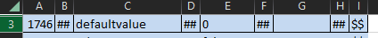

# How to use the Query Generator


## 1. Query Prototypes

### Info
Every single type of query that needs to be generated must be place in a separate file in the 
respective folder - ```\prototypes\ ``` (by default).

**Example:** 
```bash
DELETE
FROM public.entityattributesmetadata
WHERE attributeid = %s and attributekeyname = '%s' and attributekeyvalue = '%s' and tag = '%s';
```

### Naming

Prototypes and raw data files are matched in order from their respective folders, therefore it is 
advisable to use a numerical prefix in order to keep track between prototypes and raw data.

**Example:**

```bash
1-P_RM_old_meta_delete

1   -   Consecutive number         (Advisable) 
P   -   Prototype                  (Indicative)
RM  -   Product name - RiskModeler (Indicative)
old_meta_delete - text             (Indicative) 
 ```

## 2. Raw Data
### Info
Every single type of query that needs to be generated must have a raw data source file in the 
respective folder - ```\rawData\ ``` (by default).

**Example:**
```bash
1746	##	defaultvalue	##	0	##		##	$$
```
**Excel sheet view:**



Since neither ```,``` nor ``` ``` are suitable as separators, as they are valid data character,
the ```##``` separator in used, while the ```$$``` is used as parsing end of line check.
### Naming

Prototypes and raw data files are matched in order from their respective folders, therefore it is
advisable to use a numerical prefix in order to keep track between prototypes and raw data.

**Example:**

```bash
1-R_RM_old_meta_delete

1   -   Consecutive number         (Advisable) 
R   -   Raw data                   (Indicative)
RM  -   Product name - RiskModeler (Indicative)
old_meta_delete - text             (Indicative) 
 ```


## 3. Scripts
Generated scripts will be stored in ```\sqlScripts\ ``` (by default).

File names will be based on the respective prototype + the ```script_``` prefix.

**Example:**
```bash
DELETE
FROM public.entityattributesmetadata
WHERE attributeid = 1746 and attributekeyname = 'defaultvalue' and attributekeyvalue = '0' and tag = '';
```

## 4. Arguments

```bash
-p      set prototype query source folder, default - prototypes
-r      set raw data source folder, default - rawData
-d      set scripts destination folder, default - sqlScripts
-f      set output file name, default - script_full_version.txt
-h      help
```

## Version

| Documentation last update | 25.10.2023 |
|---------------------------|------------|